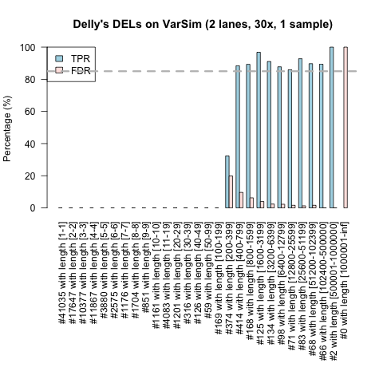

# Validate NGS-pipelines with VarSim
This document explains how we validate our NGS-pipeline. Although the data set we have simulated already contains a lot of structural variation (SNPs, insertions, deletions, tandem duplications, inversions and other complex variation), the current document first focusses only on how well our pipeline with Delly is able to find back simulated deletions.

## Installation
We have built and downloaded VarSim and its dependencies as is described on:

	http://bioinform.github.io/varsim/
	Our version: https://github.com/bioinform/varsim/releases/download/v0.5.1/varsim-0.5.1.tar.gz

The installation can be reproduced by following these steps:

	# Download varsim
	wget https://github.com/bioinform/varsim/releases/download/v0.5.0/varsim-0.5.0.tar.gz
	tar xfz varsim-0.5.0.tar.gz
	
	# Download reference and variant databases
	wget http://goo.gl/lgT18V
	wget http://web.stanford.edu/group/wonglab/varsim/insert_seq.txt
	wget http://web.stanford.edu/group/wonglab/varsim/GRCh37_hg19_supportingvariants_2013-07-23.txt
	wget http://goo.gl/NUG0dy
	gunzip hs37d5.fa.gz
	
	# make index
	module load SAMtools
	samtools faidx hs37d5.fa
	
	# Download ART
	mkdir ART
	cd ART
	wget http://www.niehs.nih.gov/research/resources/assets/docs/artbinvanillaicecream031114linux64tgz.tgz
	tar xfz artbinvanillaicecream031114linux64tgz.tgz
	cd ..

Next, we have made a module to make future use easier.

## Simulate reads with all kinds of variation
Load varsim module and JDK:

	module load varsim/0.5.1
	module load jdk/1.8.0_25 # Required by VarSim...

and run varsim to generate 30x coverage data on 2 lanes for 1 sample:

	cd /gcc/resources/validation_data/varsim

	./varsim.py --vc_in_vcf All.vcf.gz --sv_insert_seq insert_seq.txt \
	--sv_dgv GRCh37_hg19_supportingvariants_2013-07-23.txt \
	--reference /gcc/resources/b37/indices/human_g1k_v37.fasta \
	--id simu --read_length 100 --vc_num_snp 3000000 --vc_num_ins 100000 \
	--vc_num_del 100000 --vc_num_mnp 50000 --vc_num_complex 50000 --sv_num_ins 2000 \
	--sv_num_del 2000 --sv_num_dup 200 --sv_num_inv 1000 --sv_percent_novel 0.01 \
	--vc_percent_novel 0.01 --mean_fragment_size 350 --sd_fragment_size 50 \
	--vc_min_length_lim 0 --vc_max_length_lim 49 --sv_min_length_lim 50 \
	--sv_max_length_lim 1000000 --nlanes 2 --total_coverage 30 \
	--simulator_executable ART/art_bin_VanillaIceCream/art_illumina --out_dir out_20150817 --log_dir log_20150817 --work_dir work_20150817 \
	--simulator art

Remark: developers of varsim recommend to run GATK LeftAlignAndTrimVariants on any VCF file that is used as input.

### Analyse simulated data suitable with our pipeline
First, the simulated data should be made suitable for analysis with our pipeline.

	cd /gcc/resources/validation_data/varsim/out_20150817

and rename the *.fq.gz files to a format that is understood by our pipeline, e.g.
	
	150804_VARSIM_9999_ZZZZZZZZXX_L1_ZZZZZZ_1.fq.gz
	150804_VARSIM_9999_ZZZZZZZZXX_L1_ZZZZZZ_2.fq.gz
	150804_VARSIM_9999_ZZZZZZZZXX_L2_ZZZZZZ_1.fq.gz
	150804_VARSIM_9999_ZZZZZZZZXX_L2_ZZZZZZ_2.fq.gz

Next, create respective md5 checksums and copy *.fq.gz and *.fq.gz.md5 to tmp and prm storage.

	cp *.fq.gz* /gcc/groups/gaf/tmp03/rawdata/ngs/150804_VARSIM_9999_ZZZZZZZZXX/
	cp *.fq.gz* /gcc/groups/gaf/prm02/rawdata/ngs/150804_VARSIM_9999_ZZZZZZZZXX/

The corresponding worksheet is located in:
	
	/gcc/groups/gaf/tmp03/generatedscripts/Validate_VarSim/Validate_VarSim.csv
	
and describes the simulated data:

	internalSampleID,externalSampleID,project,sequencer,contact,validationLog,labStatusPhase,labStatusComments,lastUpDate,sequencingStartDate,run,flowcell,lane,barcodeMenu,seqType,prepKit,capturingKit,arrayFile,arrayID,GAF_QC_Name,GAF_QC_Date,GAF_QC_Status,GCC_Analysis,GCC_QC_Name,GCC_QC_Date,GCC_QC_Status,TargetDateShipment,DataShippedDate,DataShippedTo,DataShippedBy,Comments,barcode,barcodeType
	1,VarSimSample,Validate_VarSim,VARSIM,mdijkstra,,,,,150804,9999,ZZZZZZZZXX,1,NO_BARCODE,PE,None,None,,,,,,Yes,,,,,,,,,ZZZZZZ,SIM
	2,VarSimSample,Validate_VarSim,VARSIM,mdijkstra,,,,,150804,9999,ZZZZZZZZXX,2,NO_BARCODE,PE,None,None,,,,,,Yes,,,,,,,,,ZZZZZZ,SIM

Scripts may be generated with any generate template. Here we have used
- module load molgenis-compute/v5_20150211
- NGS_DNA_HOME="/gcc/tools/NGS_DNA-2.2.1"

After generating "1th and 2th stage", (given rundir 'run01') the jobs should be in

	/gcc/groups/gaf/tmp03/projects/Validate_VarSim/run01/jobs

Running submit.sh will analyse the simulated data with our pipeline.

### Compare
Varsim provides a tool 'vcfcompare' to compare the outcome of our pipeline to what went in it.

	module load varsim/0.5.1
	module load jdk/1.8.0_25

	cd gcc/tools/varsim_0.5.1
	java -jar VarSim.jar vcfcompare -true_vcf /gcc/resources/validation_data/varsim/out_20150817/simu.truth.vcf -prefix simu /gcc/groups/gaf/tmp03/tmp/Validate_VarSim/run01/Validate_VarSim.delly.vcf >  /gcc/groups/gaf/tmp03/tmp/Validate_VarSim/run01/CompareVarsim/ValidationDelly.stats

### Visualising the results
We start of with investigating the performance of Delly with respect to deletions. Therefore, we first manually select the CSV data that summarizes the statistics on deletions from:

	/gcc/groups/gaf/tmp03/tmp/Validate_VarSim/run01/CompareVarsim/ValidationDelly.stats

and save that in a separate file, c.q. 'ValidationDelly.stats.DEL'.

We have created the following R-script for the visualization:

	a=read.csv('ValidationDelly.stats.DEL', header=T)
	
	nTrue_Interval = paste("#", a$T, " with length ", rownames(a), sep="")
	
	par(mai = c(3.02, 0.82, 0.82, 0.42))
	barplot(rbind(a$TPR, a$FDR), col=c('lightblue', 'mistyrose'), beside=T, legend.text=c('TPR', 'FDR'), args.legend=list(x="topleft"), main="Delly's DELs on VarSim (2 lanes, 30x, 1 sample)", ylab="Percentage (%)", names.arg = nTrue_Interval, las=2)
	abline(h=85,lty=2, lwd = 3, col = "gray")

We conclude that
- True Positive Rate (TPR) is > 85% for DELs longer than 400 nucleotides
- Falde Discover Rate (FDR) is < 4% for DELs longer than 1600 nucleotides
- Please note, this is the case for DELs up to 1 milion. No longer DELs were simulated, however, Delly still wrongly claimed 46 False Positives with length > 1 milion nucleotides.

In the figure below, the labels on the x-axis have the following syntax: "#a with length [b-c]", which means that for that bin "a" DELs are simulated with a length in the interval "[b-c]".

